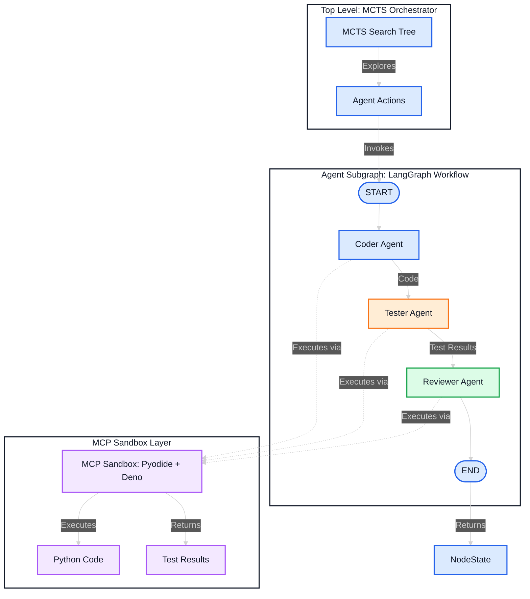
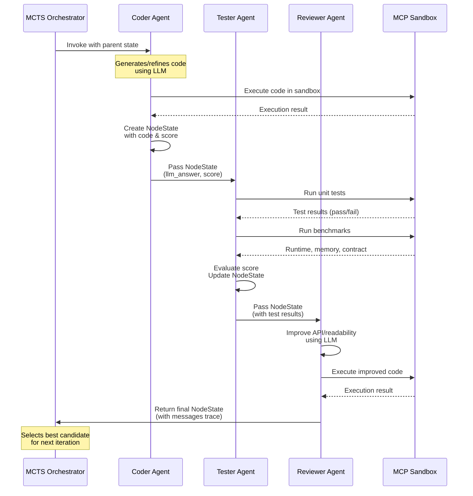
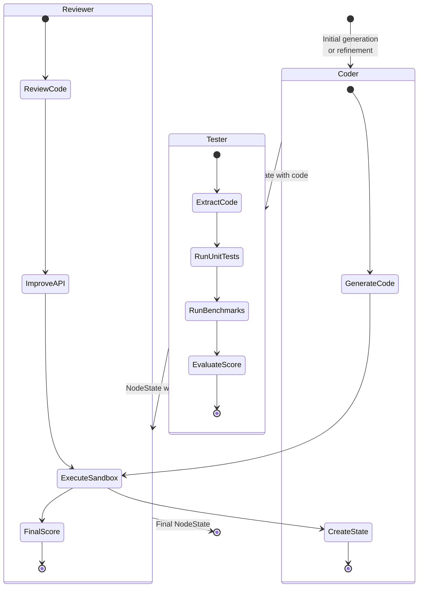
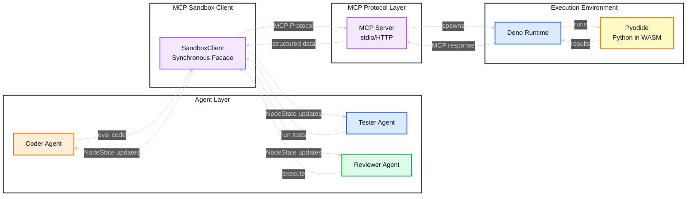
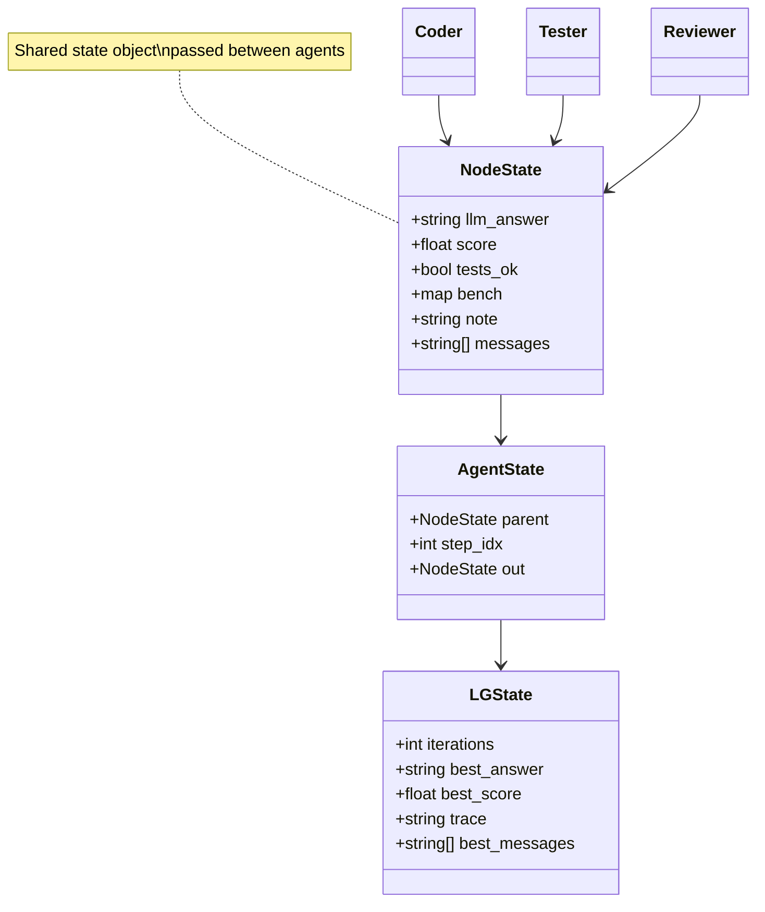
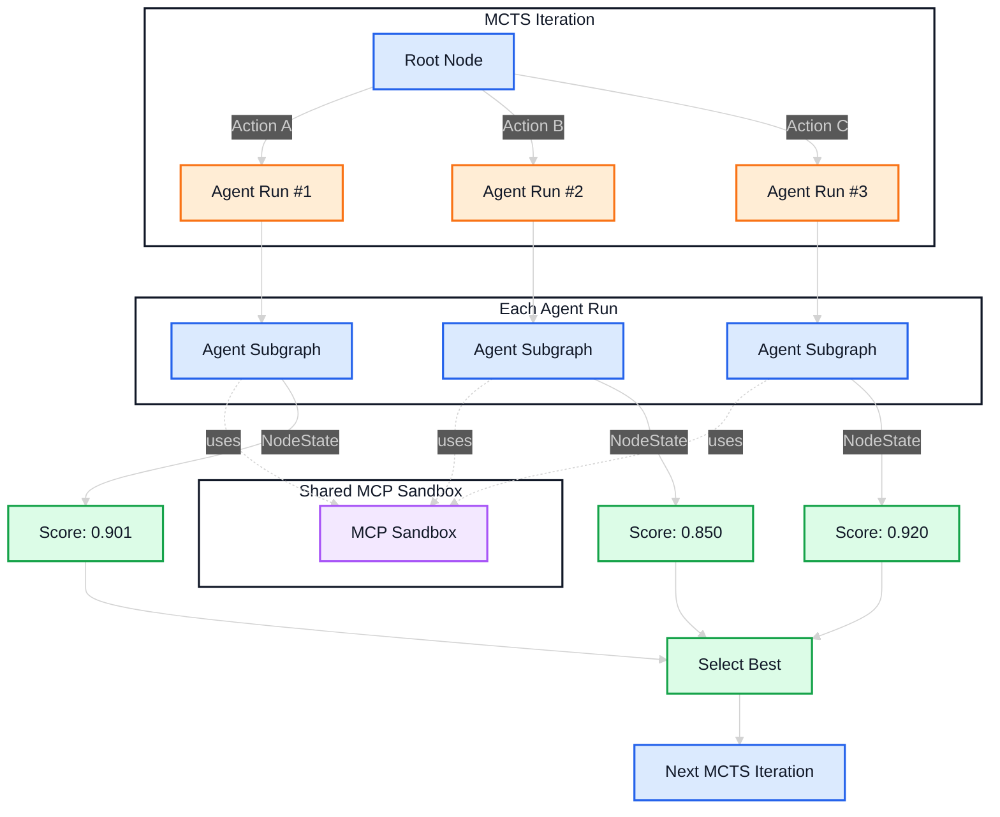
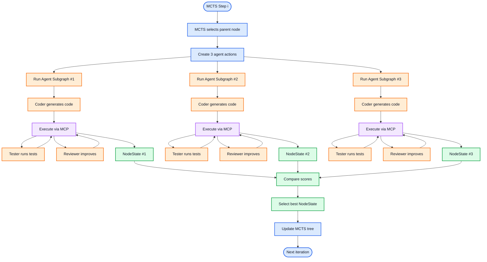

# Architectural Setup: Agent-to-Agent Communication via MCP

This document describes the architecture of the multi-agent coding system and how **MCP (Model Context Protocol)** enables secure, structured agent-to-agent communication.

---

## System Overview

The system uses a **hierarchical architecture** combining:
- **MCTS (Monte Carlo Tree Search)** for exploration and optimization
- **LangGraph** for agent workflow orchestration
- **MCP Sandbox** for secure code execution and inter-agent communication



---

## Agent Communication Flow

### How Agents Communicate

Agents communicate through **two primary mechanisms**:

1. **Shared State (LangGraph)**: Agents pass structured data through the workflow
2. **MCP Protocol**: Agents share execution results, test outcomes, and benchmarks via the sandbox



---

## Detailed Component Architecture

### 1. Agent Subgraph (LangGraph)

The agent subgraph defines a **sequential workflow** where each agent builds upon the previous agent's work:



**Key Communication Points:**
- **Coder → Tester**: Passes `llm_answer` (code) and initial `score`
- **Tester → Reviewer**: Passes test results, benchmarks, and updated `score`
- **Reviewer → MCTS**: Returns final `NodeState` with complete `messages` trace

### 2. MCP Sandbox Integration

The MCP sandbox serves as the **shared execution environment** and **communication medium**:



**MCP as Communication Protocol:**
- **Structured I/O**: All agents receive standardized responses (status, stdout, stderr, return_value)
- **Shared Context**: The sandbox maintains state across agent invocations
- **Isolation**: Each execution is isolated, preventing agent interference
- **Protocol Standardization**: MCP provides a common interface regardless of execution backend

### 3. Data Flow: NodeState Communication

Agents communicate through the `NodeState` dataclass, which carries:



**Message Trace Example:**
```
[coder] produced initial code (score=0.901)
[tester] tests_ok=True rt=2.303584000000747
[reviewer] adjusted API/readability (score=0.350)
```

---

## MCTS Integration: Multi-Agent Exploration

The MCTS algorithm orchestrates multiple agent runs in parallel:



**Key Points:**
- Multiple agent subgraphs run **concurrently** (via MCTS actions)
- All agents share the **same MCP sandbox instance** (thread-safe)
- MCTS selects the **best NodeState** based on score
- The best state becomes the **parent** for the next iteration

---

## Why MCP for Agent-to-Agent Communication?

### Traditional Approach (Without MCP)
```
Agent 1 → Direct Python exec() → Host OS
Agent 2 → Direct Python exec() → Host OS
❌ Security risks
❌ No isolation
❌ Difficult to coordinate
❌ No standardized protocol
```

### MCP-Enabled Approach
```
Agent 1 → MCP Protocol → Sandbox (isolated)
Agent 2 → MCP Protocol → Sandbox (isolated)
Agent 3 → MCP Protocol → Sandbox (isolated)
✅ Secure execution
✅ Complete isolation
✅ Shared protocol
✅ Structured communication
✅ Scalable across nodes
```

### Benefits for Multi-Agent Systems

1. **Protocol Standardization**
   - All agents use the same MCP interface
   - Consistent response format (status, stdout, stderr, return_value)
   - Easy to add new agents without changing communication layer

2. **Shared Execution Context**
   - Sandbox maintains state across agent invocations
   - Agents can build upon each other's work
   - Dependencies installed once, reused by all agents

3. **Isolation & Safety**
   - Each agent's code runs in isolation
   - No interference between concurrent agent runs
   - Timeout protection prevents hanging

4. **Distributed Communication**
   - MCP works over stdio, HTTP, or WebSocket
   - Agents can run on different nodes
   - Enables Kubernetes-based multi-agent systems

5. **Observability**
   - All agent interactions logged via MCP protocol
   - Message traces show agent handoffs
   - Easy to debug multi-agent workflows

---

## Execution Flow: Complete Example

Here's how a single MCTS iteration flows through the system:



---

## Key Design Patterns

### 1. **Sandbox as Shared Resource**
- Single `SandboxClient` instance shared across all agents
- Thread-safe execution via async event loop
- Reuses dependencies and context

### 2. **State-Based Communication**
- Agents communicate through `NodeState` objects
- Immutable state updates prevent race conditions
- Message traces provide audit trail

### 3. **Protocol Abstraction**
- Agents don't know about MCP internals
- `SandboxClient` provides clean synchronous interface
- Easy to swap MCP backends (stdio, HTTP, WebSocket)

### 4. **Hierarchical Orchestration**
- MCTS at top level (exploration strategy)
- LangGraph at agent level (workflow orchestration)
- MCP at execution level (protocol & sandboxing)

---

## Extending the Architecture

### Adding New Agents

To add a new agent (e.g., "Optimizer"):

1. **Create agent function:**
```python
def role_optimizer(sb: SandboxClient, parent: Optional[NodeState]) -> NodeState:
    # Use MCP sandbox to analyze and optimize code
    code = extract_python_block(parent.llm_answer)
    # ... optimization logic using sb.eval() ...
    return NodeState(...)
```

2. **Add to agent subgraph:**
```python
g.add_node("optimizer_ag", _optimizer)
g.add_edge("reviewer_ag", "optimizer_ag")
```

3. **Agents automatically communicate via:**
   - Shared `NodeState` (LangGraph)
   - MCP sandbox for execution (MCP Protocol)

### Distributed Agents

To run agents on different nodes:

1. **Use MCP over HTTP/WebSocket:**
```python
# Instead of stdio, use HTTP MCP server
mcp_client = MCPClientHTTP("http://agent-node-1:8080")
```

2. **Agents still communicate via:**
   - MCP protocol (standardized)
   - Shared state (via message queue or database)

---

## Summary

This architecture demonstrates how **MCP enables agent-to-agent communication** by:

1. **Providing a shared protocol** for code execution and results
2. **Enabling secure isolation** so agents don't interfere
3. **Standardizing communication** through structured I/O
4. **Supporting distributed execution** across nodes
5. **Maintaining observability** through message traces

MCP is not just a tool connector—it's a **foundation for multi-agent collaboration** where agents can safely execute code, share results, and build upon each other's work.

 